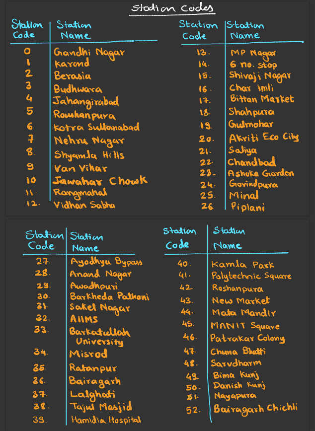
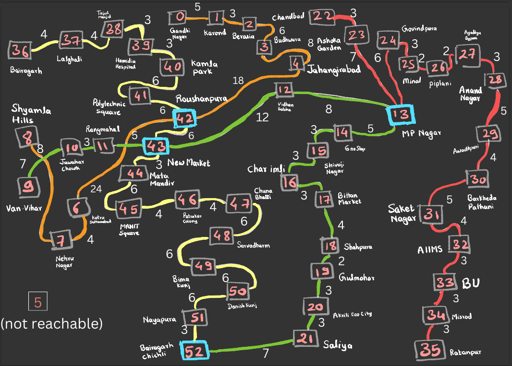
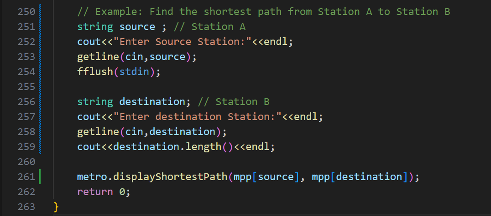
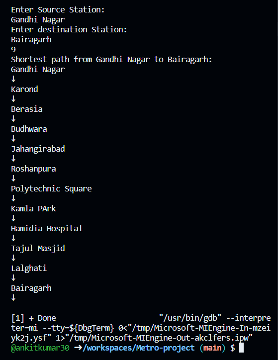

**Bhopal Metro project**

**There are 53 metro stations in Bhopal**

**Considering each station an integer value starting from 0 is assigned**

**When the user enters the source and destination station, as a result user can see the minimum number of stations between them**

**Output of the Program**

